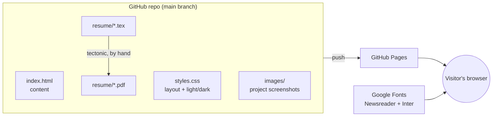

# System design

Back to the [README](../README.md) · [Instructions](INSTRUCTIONS.md) · [File structure](FILE-STRUCTURE.md)

## Overview

A single static page: one HTML file, one stylesheet, a small script for the looping clips, a folder of screenshots and clips, and a resume PDF. GitHub Pages serves it as-is. There is no build step or framework.

## Components

| Part | Job |
|---|---|
| `index.html` | All content. A sticky header, a short intro with contact links, five research/work entries laid out as a timeline (dates on the left, a two-sentence summary and a tags line), then seven project cards, and a one-line "Outside work" note above the footer. |
| `styles.css` | Typography (Newsreader serif for headings, Inter for body), a 1040 px column, a two-column project layout above 820 px that stacks on phones, and colour tokens that switch with the system's dark mode: a blue accent (dates, research chips, links) and a terracotta one (section labels, project chips), plus a faint two-colour wash behind the intro. Accent text on its chip background is at least 4.5:1 contrast in both themes. |
| `_archive/` | The blog, archived. Pages skips folders starting with `_`, so it's kept in the repo but not published. `_archive/README.md` says how to restore it. |
| `images/portrait.jpg` | The intro portrait: a pencil sketch beside the name on desktop, above it on phones. |
| `images/` | One screenshot per project, taken from each project's own repo. Each is also its project clip's poster. |
| `assets/media/` | A short looping MP4 per project card and per media research entry (PhysicsAI, Hybrid Robotics Lab, Video & Image Processing Lab), plus posters for the research ones. Placeholders until real clips are supplied; see its README. |
| `media.js` | Lazy-loads the clips: each `<source>` holds its file in `data-src`, and the script fills in `src` when the clip is within 200 px of the screen, pauses clips scrolled away, and lets a click pause or resume one. With no JavaScript or with reduced motion on, the poster shows instead. |
| `resume/` | LaTeX source and the PDF it builds. |

## Main flows

- **Visiting**: the browser loads the HTML, the stylesheet and the fonts; images below the fold load lazily. The header links jump to `#research` and `#projects`. Research comes first: it's the strongest evidence on the page.
- **Updating**: edit `index.html` or swap an image, preview with a local server, push. Pages redeploys.
- **Resume**: edit the `.tex`, rebuild with Tectonic, commit the PDF.

## Where data lives

All in the repo. Nothing is stored or collected on the site: no analytics, cookies or forms.

## Key decisions

- **Plain HTML over a framework or site generator.** One page with seven cards doesn't need one, and anyone can edit it. The cost is that repeated card markup is copied by hand.
- **No code links for private projects.** Most projects are in private repos, so their cards have a write-up and screenshot only. Neural Signal ML links to its public repo, and AlphaGo Lite to its live in-browser demo.
- **Plain-language project descriptions.** Each card says what the project does and why it's interesting before naming techniques; the techniques go in the small tags line.
- **Resume built from source.** The resume PDF is built from LaTeX in `resume/`, so it can be edited and rebuilt in one step. It lists email, LinkedIn and this site, and no phone number.
- **Link preview.** Open Graph tags and `images/og.png` (a 1200×630 render of the intro) give a title, summary and image when the link is pasted into email, Slack or an applicant tracker.
- **Not an application.** This is a static personal site, so it has no Mac app, feedback tab or settings panel.
- **A drawn portrait.** The intro portrait is a pencil sketch made from a photo with the Headshot Generator project's own image code. The source photo is not in the repo.
- **Site and resume list the same projects.** The resume points to this site for details, so every project on it has a card here. Interests outside work sit in a one-line note at the bottom, not the work timeline.
- The Neuroimaging Platform screenshot shows the MNI ICBM152 template, credited on the card as its README does.
- **Clips as muted MP4 loops, not GIFs.** `<video autoplay muted loop playsinline preload="none">` with a poster is a fraction of a GIF's size and plays inline on phones. Clips are lazy-loaded by a small script because `autoplay` would otherwise start downloading every clip on page load. The posters themselves still load with the page (browsers don't lazy-load posters); they're the same JPEGs the cards used before.
- **Follows the system's light/dark setting** with no manual toggle, to keep the page minimal.

## How it's tested

By hand, with a headless browser (Playwright) against a local server:

- every image loads;
- no horizontal scroll at 390 px (phone) or 1280 px (desktop);
- light and dark modes both read well;
- the resume PDF is one page and contains no phone number (checked with `pypdf`).

## Known limits

- Fonts come from Google Fonts; offline or blocked, the page falls back to Georgia and the system sans-serif.
- Screenshots and clips go stale as the projects change; refresh them by hand.
- Every clip is a placeholder until real media is supplied (listed in `assets/media/README.md`).
- Neural Signal ML shows only its finished spike-decoding results; its EEGNet run isn't done, so no EEGNet numbers appear. The card quotes the same R² as its figure (benchmark split).
- The Sim to Real Drone Bench image comes from its stand-in drone, since no real Crazyflie flight has been flown yet; the card says so.
- The resume build uses an absolute path to a macOS system font, so it rebuilds on a Mac only.
